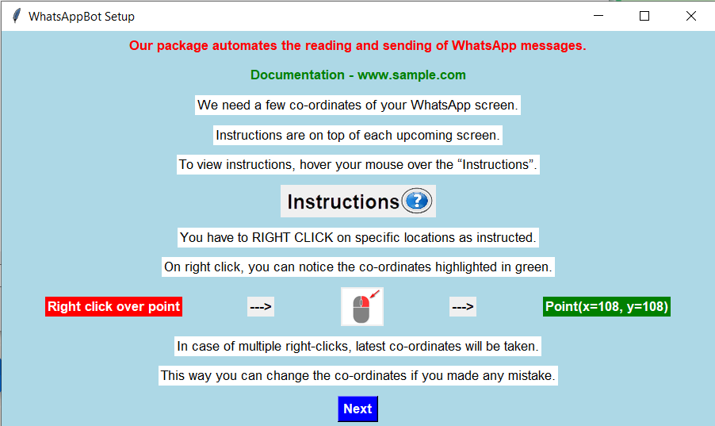

Welcome to WhatsAppBot's documentation!
========================================

**WhatsAppBot** is a Python package to automate the process of sending and replying to WhatsApp messages. It uses PyAutoGUI to acheive clicking of mouse events, type messages, select and copy messages, etc.

.. default-role:: code

Installation and Dependency
=======================

**Installation in Windows:**

.. code:: python
   
   pip install WhatsAppBot-Nanda[win32]

**Installation in other Platforms:**

.. code:: python
   
   pip install WhatsAppBot-Nanda
   
*Dependency for Mac:*
Our package has a heavy dependency on pyAutoGUI, and in some Mac systems, few of its functions does not work.
To check whether you can install WhatsAppBot in your Mac, do the following steps.

1. Install PyAutoGUI on your Mac using the below command

.. code:: python
   
   python3 -m pip install pyautogui

2. Then run the following function code snippet

.. code:: python

   import pyautogui
   pyautogui.displayMousePosition()

If you get an output similar to the one below, WhatsAppBot will work in your system.

.. code:: python

   Press Ctrl-C to quit.
   X:  0 Y: 1027 RGB: ( 108,  7,  3)
   
But if you get an output similar to the one below, WhatsAppBot will not work in your system.

.. code:: python

   Press Ctrl-C to quit.
   X:  0 Y: 1027 RGB: ( NaN,  NaN,  NaN)
   
  
Creating an instance using constructor
=======================

To create a new setup, run the below script.

.. code:: python
   
   from WhatsAppBot import *
   
   WTBot = WhatsAppBot('create a new setup')

An installer will appear which will guide you through the setup process. 
It is **highly recommended** to watch `this <https://www.youtube.com/>`_ video on how to setup. 

After setting up, use the setup name you entered during the setup process to create an instance.

.. code:: python
   
   from WhatsAppBot import *
   
   WTBot = WhatsAppBot('setup name you entered')

Functions
=======================

You can also watch `this <https://www.youtube.com/>`_ video to understand how to use these functions.

=============================
newMessagesThere(self)
=============================

**Function Description and Working:**

| This Functions returns a boolean value (True or False).
| If there are new messages (unread messages), it returns True, otherwise False.
| It uses the red color notification dot on WhatsApp icon to acheive this.
| So this function is available only for WhatsApp Desktop Application in Windows and Mac, and not for WhatsApp Web.

**Usage:**

.. code:: python

   WTBot.newMessagesThere()

**Returns:**

.. code:: python
   
   # if there are unread messages yet to be opened
   >> True
   
   # if all messages are read and there is no new message
   >> False

=============================
getNewMessages(self)
=============================

**Function description and working:**

It opens WhatsApp and turns on the unread chat filter. It then opens chats under the filter one by one untill there is nothing left. For each chat, it first scrolls down till the end of chat, while intelligently noting how much it has scrolled down. It then opens contact info (or group info) to copy information about the sender. It closes the contact info and selects messages. It copies it to the clipboard and parses it to discard previously read messages and returns the new messages in the below format. After reading all messages it minimizes WhatsApp.

**Usage:**

.. code:: python

   WTBot.getNewMessages()

**Return Template:**

.. code:: python
   
   [
      ["Group Chat", group_name, [date_time_string, user_name, phone_number, msg]],
      ["Personal Chat", user_name, phone_number, [date_time_string, msg]],
      ...,
      ...
   ]

It returns a list of new messages clubbed together with the chat.
Must make it clear it is list of messages, give example. 
Above it template.
Order may be different, check...

**Return Example:**

.. code:: python
   
   [
      ["Group Chat", 'Sample Group 1', 
         [
            ['2023-01-01 15:30', 'nanda', '+91 99524 02150', 'Hi I am Nanda'],
            ['2023-01-01 15:31', 'niresh', '+91 99524 02623', 'Hi I am Niresh'],
            ['2023-01-01 15:34', 'nanda', '+91 99524 02150', 'Good Morning']
         ]
      ],
      ["Personal Chat", 'nanda', '+91 99524 02150', 
         [
            ['2023-01-01 15:30', 'Where are you?'],
            ['2023-01-01 15:31', 'Have you reached home?'],
            ['2023-01-01 15:31', 'Call me back']
         ]
      ],
      ...,
      ...
   ]

=============================
sendMessage(self, personal_or_grp, message_to, message_type, text, image_location)
=============================

This function opens WhatsApp, searches **message_to** and opens it. It it then sends text or image as specified.

**Usage:**

.. code:: python

   WTBot.sendMessage(personal_or_grp, message_to, message_type, text, image_location)

**Arguments:**

1. personal_or_grp:
      Objective: Specify the type of message
      
      Values: "Personal Chat", "Group Chat"
2. message_to:
      Objective: To whom the message is being sent to
      
      Values: Phone Number (or) Contact Name, (Type: String)
              
              '6374680762'       -> wrong
              
              '+91 6374 680 762' -> correct
3. message_type:
      Objective: Specify the type of message
      
      Values: "Text", "Image"
4. text:
      Objective: The text String that needs to be sent, (message_type should be set as "Text")
      
      Values: The message in String format
5. image_location:
      Objective: The path to the image that needs to be sent, (message_type should be set as "Image")
      
      Values: The path to the image in String format
               
               (While Windows supports all image formats, Mac only supports .jpeg)
   
**Example:**

.. code:: python
   
   WTBot.sendMessage(personal_or_grp='Personal Chat', message_to='+91 99524 02150', message_type='Text', text='hello how are you')
   WTBot.sendMessage(personal_or_grp='Personal Chat', message_to='Nanda', message_type='Text', text='hello how are you')
   WTBot.sendMessage(personal_or_grp='Group Chat', message_to='Group Name', message_type='Image', image_location=r'C:\Users\nanda\Downloads\dhoni.jpeg')
   

=============================
sendMultipleMessages(self, list_of_replies):
=============================

This function does the same as functionality as sendMessage, but is highly optimised when sending multiple messages. You can buffer the send operations, and give it to this function as a list.

**Usage:**

.. code:: python

   WTBot.sendMultipleMessages(list_of_replies)

**Arguments:**

.. code:: python
   
   # list_of_replies is in the below format
   list_of_replies = [
                        ['Personal Chat',ph_no_or_name,[
                                                         [msg1_type,msg1],
                                                         [msg2_type,msg2],
                                                         [msg3_type,msg3],
                                                         .....
                                                        ]
                        ],
                        ['Group Chat',group_name,[
                                                   ['Image',img_location],
                                                   ['Text',text_msg]
                                                  ]
                        ],
                        [....],
                        [....],
                        ...
                     ]
   
**Example:**

.. code:: python
   
   # list_of_replies is in the below format
   list_of_replies = [
                        ['Personal Chat','+91 99524 02150',[
                                                            ['Text','Hi'],
                                                            ['Text','Hello']
                                                           ]
                        ],
                        ['Group Chat','Sample Group 1',[
                                                         ['Image','C:\\Users\\nanda\\Downloads\\dhoni.jpeg'],
                                                         ['Text','How is it?']
                                                       ]
                        ]
                     ]

=============================
getPreviousMessages(count, personal_or_grp, ph_no_or_name, message_type, start_date_time, end_date_time)
=============================

This function returns the previously sent and received messages as list sorted by the date-time of the message (earliest to latest) [start_date_time to end_date_time] . The arguments to the functions are various filters you can use.
Note: You will only get messages that were read or sent by using the package. That means only the messages that were sent using WTBot.sendMessage() and read using WTBot.getNewMessages() will be available

**Usage:**

.. code:: python

   getPreviousMessages(count, personal_or_grp, ph_no_or_name, message_type, start_date_time, end_date_time)

**Arguments:**

1. count:
      Objective: Specifies the number of records to be returned
      
      Values: Integer value, default: 100
2. personal_or_grp:
      Objective: Specify the type of message to be returned
      
      Values: "Personal Chat", "Group Chat"
         
         default: None -> both types
3. ph_no_or_name:
      Objective: To whom the message is being sent to
      
      Values: Phone Number (or) Contact Name, (Type: String), default: 'Both'
             
              '6374680762'       -> wrong
              
              '+91 6374 680 762' -> correct
4. message_type:
      Objective: Specify the type of message
      
      Values: "Text", "Image", default: 'Both'
5. start_date_time:
      Objective: Specify start date
      
      Values: Date in 'YYYY-MM-DD HH:MM' format default: '1970-01-01 00:00'
6. end_date_time:
      Objective: Specify end date
      
      Values: Date in 'YYYY-MM-DD HH:MM' format, default: '3000-01-01 00:00'
   
**Example:**

.. code:: python
   
   WTBot.getPreviousMessages(count, personal_or_grp, ph_no_or_name, message_type, start_date_time, end_date_time)
   WTBot.getPreviousMessages(count, personal_or_grp, ph_no_or_name, message_type, start_date_time, end_date_time)
   WTBot.getPreviousMessages(count, personal_or_grp, ph_no_or_name, message_type, start_date_time, end_date_time)

**Return Template:**

.. code:: python
   
   "Group Chat", msg_type = Received, group_name, date_time_string, user_name, phone_number, msg
   "Group Chat", msg_type = Sent, group_name, date_time_string, msg
   "Personal Chat", msg_type = Sent/Received, user_name, phone_number, date_time_string, msg

**Return Example:**

.. code:: python
   
   [
   [],
   [],
   []
   ]

=============================
changeTimeDelays(waiting_time_delay, mouse_delay, typing_delay)
=============================

**Function Description and Working:**

This is used to change the time delays of an already existing setup. All the 3 arguments have a default parameter as None, so you can change just one or two of them as you please. All 3 arguments take only float.

**Usage:**

.. code:: python

   WTBot.changeTimeDelays(waiting_time_delay, mouse_delay, typing_delay)

**Example:**

.. code:: python
   
   WTBot.changeTimeDelays(waiting_time_delay, mouse_delay, typing_delay)
   ..........
     
=============================
resetWhatsappBot(self)
=============================

**Function Description and Working:**

This function deletes all the previously read and sent messages. So once you call this, the getPreviousMessages() function returns empty list (untill ofcourse when new messages are read using getNewMessages(), and sent using sendMessage().
Call this function when you want to discard old messages and start afresh.

**Usage:**

.. code:: python

   WTBot.resetWhatsappBot()

   

